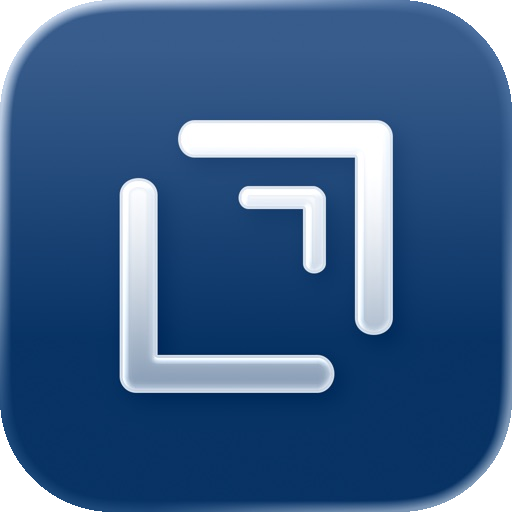

<p align="center">
  
</p>

<h1 align="center">Drafts Web Capture</h1>

<p align="center">
  <strong>A zero-backend web application for capturing text directly to your Drafts library via Mail Drop.</strong>
</p>

<p align="center">
  <code>Zero Backend</code> &bull;
  <code>Mail Drop Sync</code> &bull;
  <code>Offline-First</code>
</p>

<p align="center">
  <a href="LICENSE">
    
  </a>
  <a href="https://www.buymeacoffee.com/oliverames">
    
  </a>
</p>

---

An unofficial static web app that lets you write, tag, and send drafts directly into the [Drafts](https://getdrafts.com) app (by [Agile Tortoise](https://agiletortoise.com)) via Mail Drop. Currently deployed at [drafts.amesvt.com](https://drafts.amesvt.com).

## Why This Exists

I wanted a way to write from any computer (especially Windows or Linux machines where the native Drafts app isn't available) and have it sync instantly to my iPhone and iPad.

Drafts features a "Mail Drop" integration, allowing you to send emails to a secret address to create drafts. However, writing emails is clunky. This app acts as a beautiful, offline-capable Markdown editor that wraps the Mail Drop functionality. You type in a real editor, add tags, and when you hit "Create", a Cloudflare Worker securely emails the payload to your Mail Drop address.

## Quick Start

You can run the web client locally:

```bash
# Clone the repository
git clone https://github.com/oliverames/drafts-web.git
cd drafts-web

# Serve the public directory locally
npx serve public
# or: python3 -m http.server 8091 --directory public
```

## Core Features

- **Mail Drop Sync:** Writes directly to the Drafts app via your secure Mail Drop address.
- **Offline Queue:** Continue capturing even without an internet connection. Drafts are queued in local storage and submitted when you come back online.
- **Rich Editor:** Powered by CodeMirror 6 with full Markdown syntax highlighting.
- **Write / Preview Toggle:** Switch between writing and a live rendered preview. Supports Markdown, MultiMarkdown, and GitHub Markdown; Plain Text, Taskpaper, and Simple List render as plain text.
- **Multi-Tab Workspace:** Open multiple drafts side-by-side with horizontal tab drag-to-scroll.
- **Tags, Flagged, Location:** Tag chips, a flagged state, and optional GPS coordinates are all sent through to Drafts via the email payload.
- **File Attachments:** Attach files to a draft before sending.
- **Bookmarklet Ready:** Accepts URL parameters (`?text=`, `?tags=`, `?url=`, `?title=`, `?sel=`) for browser extension and bookmarklet integration.

## Architecture

| Layer | Implementation | Description |
|---|---|---|
| **Hosting** | GitHub Pages | Auto-deployed on push to `main` via Actions |
| **Editor** | CodeMirror 6 | Provides Markdown highlighting and text formatting |
| **Transport** | Cloudflare Worker | `drafts-ck-proxy.oliverames.workers.dev` accepts the payload and uses the Resend API to email the Mail Drop address |

### The Email Proxy

The frontend sends your draft content to a lightweight Cloudflare Worker. The Worker takes the first line of your draft (plus any tags formatted as `#hashtags`) and sets it as the email Subject, placing the rest of the text in the email Body. It then uses the [Resend API](https://resend.com) to instantly dispatch the email.

## Configuration

For production deployments, you must configure your Cloudflare Worker with a Resend API key.

```bash
npx wrangler secret put RESEND_API_KEY
```

## Building / Development

1. Make your changes in the `public/` directory (vanilla HTML/CSS/JS).
2. Test locally using `npx serve public`.
3. Push to `main` to trigger the GitHub Pages deployment.

---

<p align="center">
  <a href="https://www.buymeacoffee.com/oliverames">
    
  </a>
</p>

<p align="center">
  <sub>
    Built by <a href="https://ames.consulting">Oliver Ames</a> in Vermont
    &bull; <a href="https://github.com/oliverames">GitHub</a>
    &bull; <a href="https://linkedin.com/in/oliverames">LinkedIn</a>
    &bull; <a href="https://bsky.app/profile/oliverames.bsky.social">Bluesky</a>
  </sub>
</p>
